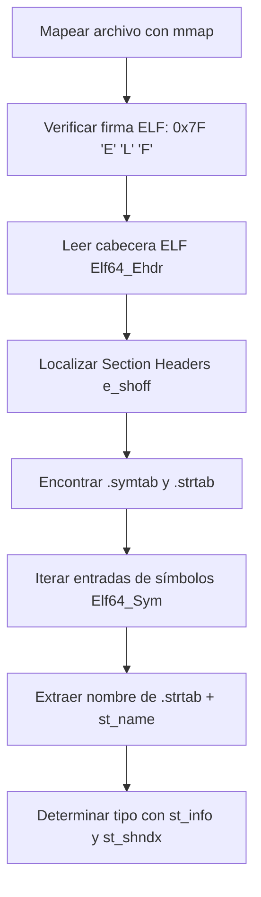

Es fundamental entender a fondo qué hace una herramienta como `nm` antes de intentar recrearla.

El comando `nm` es una utilidad de línea de comandos en sistemas tipo Unix que se utiliza para **inspeccionar los archivos objeto, librerías estáticas y librerías compartidas (ejecutables) para listar los símbolos que contienen.** Estos símbolos son los nombres de funciones y variables que un programa usa o define.

### Explicación + Demostraciones Prácticas
---

**¿Qué hace `nm`?**  
El comando `nm` (symbol table **N**a**M**e viewer) inspecciona archivos binarios para extraer su tabla de símbolos. Estos símbolos incluyen:  
1. Funciones definidas/usadas  
2. Variables globales  
3. Direcciones de memoria  
4. Tipos de sección (texto, datos, bss)  

**Estructura clave:**  
```c
typedef struct {
    Elf64_Addr    st_value;  // Dirección del símbolo
    Elf64_Xword   st_info;   // Tipo y binding
    char          st_name[]; // Nombre (en .strtab)
} Elf64_Sym;
```

---

### 🔍 Demostraciones Prácticas (¡Pruébalas en tu terminal!)

#### 1. Símbolos en un programa simple:
**Código (`test.c`):**
```c
#include <stdio.h>
int global_var = 42;

void func() {
    static int static_var;
    printf("Hello\n");
}

int main() {
    func();
    return 0;
}
```

**Compilación y análisis:**
```bash
gcc -c test.c -o test.o  # Compila sin enlazar
nm test.o
```

**Salida típica:**
```
0000000000000000 T func
0000000000000004 C global_var
0000000000000000 T main
                 U printf
0000000000000004 b static_var
```

#### 2. Tipos de símbolos comunes:
| Símbolo | Significado              | Ejemplo real       |
|---------|--------------------------|--------------------|
| **T**   | Text (función definida)  | `00000000 T main`  |
| **U**   | Undefined (extern)       | `U printf`         |
| **D**   | Data (var. global init)  | `00000004 D var`   |
| **B**   | BSS (var. global no init)| `00000000 B buffer`|
| **C**   | Common (uninitialized)   | `C global_uninit`  |

#### 3. Análisis de bibliotecas:
```bash
# Inspeccionar libc (¡cuidado! salida enorme)
nm /usr/lib/libc.dylib | head -20

# Buscar una función específica
nm /usr/lib/libc.dylib | grep -w "malloc"
```
**Salida:**  
`000000000007f0f0 T _malloc`

#### 4. Opciones avanzadas:
```bash
# Mostrar tamaños de símbolos
nm -S test.o

# Ordenar por dirección de memoria
nm -n test.o

# Mostrar solo símbolos externos
nm -g test.o
```

#### 5. Caso real: Depuración de símbolos faltantes
```bash
# Compilar sin incluir biblioteca
gcc test.c -o test -lcrypto

# Error al ejecutar:
./test: symbol lookup error: ./test: undefined symbol: RSA_new

# Diagnóstico con nm:
nm test | grep RSA_new
```
**Salida:**  
`U RSA_new` → ¡Falta enlazar OpenSSL!

---

### 🧠 Puntos clave para tu proyecto `nm` de 42:
1. **Parsing ELF:** Deberás interpretar:
   - Section headers (`.symtab`, `.strtab`)
   - Symbol types (`STT_FUNC`, `STT_OBJECT`)
   - Binding (`STB_LOCAL`, `STB_GLOBAL`)

2. **Retos comunes:**
   ```c
   // Manejo de diferentes arquitecturas
   #ifdef __LP64__
   typedef Elf64_Ehdr Elf_Header;
   #else
   typedef Elf32_Ehdr Elf_Header;
   #endif
   ```

3. **Opciones a implementar Bonus part:**
   ```bash
   -a  # Mostrar todos los símbolos
   -r  # Orden inverso
   -u  # Sólo símbolos no definidos
   -p  # Sólo símbolos globales
   -g  # Sin ordenamiento
   ```

**Consejo final:** Usa `readelf -s` como referencia para comparar salidas durante tu desarrollo:
```bash
readelf -s test.o
```

---

### 🧠 Vamos a explicar paso a paso qué ocurre cuando ejecutas `nm` con uno o más argumentos:

### **Qué hace `nm` (Proceso Interno Detallado para cada Archivo)**

Cuando `nm` recibe el nombre de un archivo (o nombres de varios archivos), para **cada archivo individualmente**, realiza el siguiente proceso:

1.  **Paso 1: Recepción del Argumento (Ruta del Archivo)**
    * `nm` recibe la ruta completa o relativa del archivo que debe analizar como un argumento de la línea de comandos.

2.  **Paso 2: Apertura y Validación Básica del Archivo**
    * Intenta abrir el archivo especificado en modo de lectura.
    * Verifica si el archivo existe y si tiene los permisos de lectura necesarios. Si no, `nm` reporta un error (ej. "No such file or directory" o "Permission denied") y pasa al siguiente archivo si hay más.

3.  **Paso 3: Identificación del Formato del Archivo (Magic Bytes / ELF Header)**
    * Lee los primeros bytes del archivo. Estos son los "números mágicos" (magic bytes) que indican el tipo de formato del archivo.
    * En sistemas Linux, `nm` espera principalmente encontrar archivos en formato **ELF (Executable and Linkable Format)**.
    * Verifica los bytes iniciales del ELF Header para confirmar que es un archivo ELF válido.
    * A partir del ELF Header, determina la **clase del ELF** (si es un binario de 32 bits o de 64 bits) y la **arquitectura de la máquina** para la que fue compilado (ej. x86, ARM).
    * Si el archivo no es un formato reconocido (ej. es un archivo de texto, una imagen, o un formato binario diferente), `nm` informa de un error (ej. "file format not recognized") y pasa al siguiente archivo.

4.  **Paso 4: Mapeo del Archivo en Memoria (`mmap`)**
    * Una vez que se confirma que es un archivo ELF, `nm` utiliza la llamada al sistema `mmap()` para mapear todo el contenido del archivo directamente en la memoria virtual de su propio proceso.
    * Esto es crucial para el rendimiento, ya que permite acceder a cualquier parte del archivo como si fuera un array en memoria, sin tener que hacer múltiples lecturas de disco.

5.  **Paso 5: Parseo del Encabezado ELF Principal**
    * Accede al ELF Header mapeado en memoria.
    * Lee información clave como:
        * `e_shoff`: El offset (desplazamiento) dentro del archivo donde comienza la Tabla de Encabezados de Sección (Section Header Table - SHT).
        * `e_shnum`: El número de entradas en la SHT.
        * `e_shentsize`: El tamaño de cada entrada en la SHT.
        * `e_shstrndx`: El índice de la sección dentro de la SHT que contiene los nombres de las secciones (Section Header String Table).

6.  **Paso 6: Localización de la Tabla de Encabezados de Sección (SHT)**
    * Utiliza `e_shoff` para navegar directamente a la SHT en la memoria mapeada.
    * La SHT es un array de estructuras `Elf_Shdr` (o `Elf64_Shdr` para 64 bits, `Elf32_Shdr` para 32 bits), cada una describiendo una sección lógica del binario.

7.  **Paso 7: Localización de la Tabla de Nombres de Secciones (`.shstrtab`)**
    * Usando `e_shstrndx`, `nm` identifica cuál entrada de la SHT corresponde a la tabla de cadenas de nombres de secciones (`.shstrtab`).
    * Obtiene el offset y el tamaño de `.shstrtab` de su entrada `Elf_Shdr`. Esta tabla es fundamental porque contiene los nombres de todas las demás secciones (como `.symtab`, `.strtab`, `.text`, `.data`), lo que permite a `nm` encontrarlas por su nombre.

8.  **Paso 8: Localización de las Tablas de Símbolos (`.symtab`, `.dynsym`) y Cadenas Asociadas (`.strtab`, `.dynstr`)**
    * `nm` itera a través de cada entrada en la SHT (usando `e_shnum` y `e_shentsize`).
    * Para cada entrada, usa el offset del nombre de la sección (`sh_name`) en `.shstrtab` para obtener el nombre real de la sección.
    * Busca secciones con nombres como:
        * **`.symtab`:** La tabla de símbolos principal, que contiene la mayoría de los símbolos estáticos y globales.
        * **`.strtab`:** La tabla de cadenas asociada a `.symtab`, donde se almacenan los nombres reales de los símbolos.
        * **`.dynsym`:** Una tabla de símbolos para símbolos dinámicos (usados para enlace en tiempo de ejecución, como funciones de librerías compartidas).
        * **`.dynstr`:** La tabla de cadenas asociada a `.dynsym`.
    * Cuando encuentra estas secciones, guarda sus offsets, tamaños y tipos (`SHT_SYMTAB`, `SHT_STRTAB`).

9.  **Paso 9: Parseo de las Entradas de la Tabla de Símbolos**
    * Para cada tabla de símbolos encontrada (`.symtab` y `.dynsym`), `nm` itera sobre sus entradas. Cada entrada es una estructura `Elf_Sym` (o `Elf64_Sym` / `Elf32_Sym`).
    * Calcula el número de símbolos dividiendo el tamaño de la sección de símbolos por el tamaño de una entrada `Elf_Sym`.

10. **Paso 10: Extracción y Determinación del Tipo de Símbolo**
    * Para cada `Elf_Sym` en la tabla de símbolos:
        * **Nombre del Símbolo:** Accede a la tabla de cadenas de símbolos (`.strtab` o `.dynstr`) usando el offset `st_name` del símbolo para obtener su nombre legible.
        * **Valor/Dirección del Símbolo:** Obtiene la dirección o valor del símbolo desde el campo `st_value`.
        * **Tipo del Símbolo (el carácter `T`, `D`, `U`, etc.):** Esta es la parte más compleja. El tipo de símbolo se deriva de una combinación de factores, principalmente:
            * **`st_info`:** Este campo contiene dos piezas de información:
                * **`ELF_ST_TYPE(st_info)`:** Indica la categoría del símbolo (función, objeto de datos, sección, etc.).
                * **`ELF_ST_BIND(st_info)`:** Indica la vinculación del símbolo (local, global, débil).
            * **`st_shndx`:** El índice de la sección a la que se refiere el símbolo. Valores especiales como `SHN_UNDEF` (indefinido, el símbolo se usa pero no se define aquí), `SHN_ABS` (valor absoluto), `SHN_COMMON` (símbolo "común" no asignado).
            * `nm` tiene una lógica interna compleja para mapear estas combinaciones a un solo carácter (ej. `'T'` para funciones globales en la sección de texto, `'t'` para funciones locales, `'D'` para datos globales inicializados, `'U'` para indefinidos, `'W'` para símbolos débiles, etc.).
            * (Opcional, pero relevante para nm completo): Considera también el tamaño del símbolo (`st_size`).

11. **Paso 11: Filtrado y Recolección de Símbolos Relevantes**
    * `nm` ignora ciertos símbolos (ej. símbolos de depuración, símbolos de sección interna sin interés para el usuario, algunos símbolos locales si no se usa la opción `-a`). Los símbolos que cumplen los criterios se añaden a una lista interna.

12. **Paso 12: Ordenamiento de Símbolos**
    * La lista recolectada de símbolos se ordena. El criterio principal es el **orden alfabético por el nombre del símbolo**.
    * Si dos símbolos tienen el mismo nombre, se aplican criterios secundarios de desempate (ej. por valor/dirección del símbolo, por tipo de símbolo).

13. **Paso 13: Formateo e Impresión de la Salida**
    * `nm` recorre la lista de símbolos ya ordenada y los imprime en la salida estándar (`stdout`) en un formato específico:
        * **Dirección:** Un valor hexadecimal (rellenado con ceros a la izquierda si es necesario para la arquitectura de 32 o 64 bits).
        * **Tipo de Símbolo:** El carácter simple (ej. `T`, `D`, `U`).
        * **Nombre del Símbolo:** La cadena legible.
    * Añade espacios o padding para alinear las columnas y mejorar la legibilidad.

14. **Paso 14: Limpieza de Memoria y Cierre del Archivo**
    * Una vez que se han procesado e impreso todos los símbolos del archivo, `nm` libera la memoria mapeada (`munmap()`) y cierra el descriptor de archivo (`close()`).

### **Comportamiento con Múltiples Argumentos (`nm file1 file2 ...`)**

Si `nm` se invoca con más de un argumento de archivo, repite el **proceso completo descrito anteriormente para cada archivo en el orden en que fueron dados**.

* **Encabezado por Archivo:** Antes de listar los símbolos de un nuevo archivo (si no es el primero), `nm` suele imprimir un encabezado que indica el nombre del archivo que se está procesando actualmente, por ejemplo:
    ```
    file1.o:
    (lista de símbolos de file1.o)

    file2.so:
    (lista de símbolos de file2.so)
    ```
* **Independencia de Errores:** Si un archivo falla en su procesamiento (ej. no existe, formato no reconocido), `nm` reporta el error para ese archivo en particular, pero **continúa intentando procesar los siguientes archivos** en la lista de argumentos. No se detiene en el primer error.

En resumen, `nm` es una herramienta vital para la introspección de binarios, y su funcionalidad, aunque parece sencilla desde fuera, implica un conocimiento profundo de la estructura de archivos ELF y un manejo robusto de la memoria y el sistema de archivos.

---
---
---

### **Claves para Implementar el Parser ELF Correctamente**

1. **Estructura Fundamental del ELF**
   ```c
   ELF Header (Elf64_Ehdr)
   ├── Program Headers (Opcional para nm)
   └── Section Headers (Elf64_Shdr)
       ├── .text (código)
       ├── .data (datos inicializados)
       ├── .bss (datos no inicializados)
       ├── .symtab (TABLA DE SÍMBOLOS - tu objetivo principal)
       └── .strtab (STRINGS DE SÍMBOLOS)
   ```

2. **Pasos Críticos del Parser**



3. **Cómo Determinar el Tipo de Símbolo**
   - **Bind**: `ELF64_ST_BIND(sym->st_info)`
     - `STB_GLOBAL` -> 'g' (mayúscula en nm)
     - `STB_LOCAL` -> 'l' (minúscula en nm)
   - **Type**: `ELF64_ST_TYPE(sym->st_info)`
     - `STT_FUNC` -> 'T' (texto)
     - `STT_OBJECT` -> 'D' (data)
     - `STT_NOTYPE` -> '?' + verificar sección

4. **Manejo de Secciones Clave**
   ```c
   if (sym->st_shndx == SHN_UNDEF)  // Símbolo indefinido
      type = 'U';
   else if (sym->st_shndx == SHN_ABS) // Símbolo absoluto
      type = 'A';
   else {
      Elf64_Shdr *sec = &section_headers[sym->st_shndx];
      if (sec->sh_type == SHT_NOBITS)  // Sección .bss
          type = 'B';
   }
   ```

5. **Retos Comunes y Soluciones**
   - **Endianness**: Usar `__builtin_bswap32/64` si `e_ident[EI_DATA]` != host
   - **32/64 bits**: Checkear `e_ident[EI_CLASS]` y usar Elf32/Elf64 dinámicamente
   - **Secciones vacías**: Saltar símbolos con `st_name == 0`
   - **Símbolos de depuración**: Filtrar por `STB_LOCAL` y tipo `STT_SECTION`

### **Consejos de Implementación**
1. Usa **uniones** para manejar Elf32/Elf64:
   ```c
   typedef union {
       Elf64_Ehdr elf64;
       Elf32_Ehdr elf32;
   } t_elf_header;
   ```

2. Para secciones críticas:
   ```c
   #define ELF64_ST_BIND(info)          ((info) >> 4)
   #define ELF64_ST_TYPE(info)          ((info) & 0xF)
   ```

3. Valida siempre offsets:
   ```c
   if (e_shoff > file_size) {
       // Manejar error: cabecera fuera de rango
   }
   ```

### **Pruebas Obligatorias**
1. Archivos de diferentes arquitecturas:
   ```bash
   file /usr/bin/* | grep ELF | awk -F: '{print $1}' | xargs -n1 ./ft_nm
   ```

2. Casos límite:
   - Archivos vacíos
   - Binarios truncados
   - Objetos sin tabla de símbolos
   - Múltiples endianness
